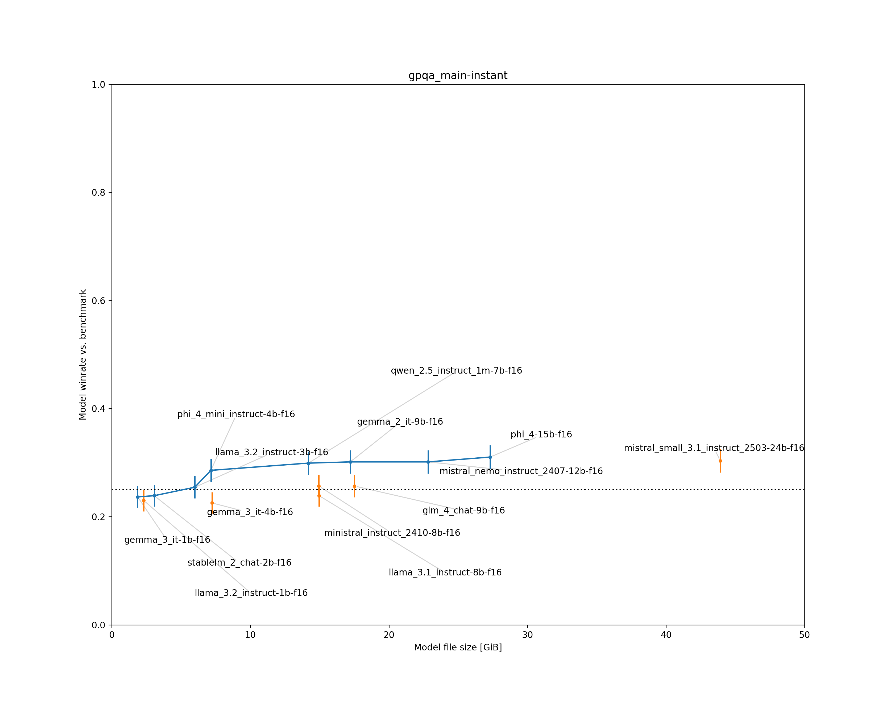
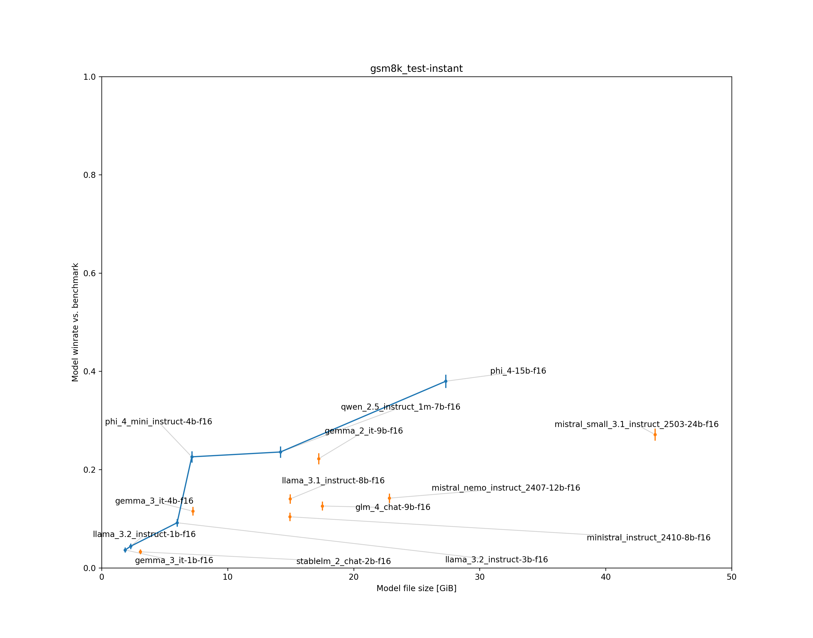

## Elo HeLLM

*Elo HeLLM* is a project for establishing a ranking based on Elo ratings between large language models.
The context is that I'm working on training code for [llama.cpp](https://github.com/ggml-org/llama.cpp).
llama.cpp has methods for estimating the quality loss from quantization but it lacks methods
for estimating the quality of a model in absolute terms or for making comparisons between different models.
I intend to co-develop this project with the llama.cpp training code for quality control.
The approach is to merge an arbitrary number of quality metrics into a single 
Elo rating for a model using statistical methods.
One category of such quality metrics are simply the results of language model benchmarks such as MMLU.
Results from competitive games such as Chess can also be used (not yet implemented).

As of right now the project is still very much a work in progress;
the code is bad and not really portable but I think that it works as a proof of concept.

### Methodology

An Elo ranking assumes that the probability for player A to win against player B can be calculated from
their ratings $R_\mathrm{A}$ and $R_\mathrm{B}$ as follows:

$$P_\mathrm{AB} = \frac{1}{1 + 10^\frac{R_\mathrm{B} - R_\mathrm{A}}{S}}, $$

where $S$ is an essentially arbitrary non-negative value (usually chosen as 400).

Elo HeLLM assumes that each LLM can be assigned a single Elo rating to describe its general performance.
The performance of LLMs on language model benchmarks is interpreted as a series of games where the LLM
winning/losing against a benchmark is equivalent to the LLM succeeding/failing on an individual benchmark challenge.
Since the probability of the LLM winning against the benchmark on one of the challenges is assumed to be constant
the total number of wins can be modeled with a binomial distribution.
Given a set of benchmark results it is then possible to determine the most likely 
LLM and benchmark Elo ratings using the method of maximum likelihood.

The LLM Elo ratings are parameterized in such a way that their average is 1500.
In addition to their Elo ratings, each benchmark is given an individual scale $S$, 
the scales are parameterized in such a way that their average is 400.
The benchmark Elo ratings are in principle unbounded but they are constrained by their Elo ratings relaive to the LLMs.
If no uncertainties other than the statistical uncertainty from the binomial distribution are assumed, 
then the modeling using Elo ratings as described can be rejected with high statistical significance.
Specifically, what is being rejected is that a single Elo rating per LLM can perfectly predict
its performance across multiple benchmarks.
However, any model can be made to fit any data by increasing the uncertainty.
In practice this means approximating the binomial distribution with a normal distribution 
(which should be fine at the used sample sizes)
and adding an additional, uncorrelated uncertainty to the win probability calculated from the difference in Elo ratings.
This additional uncertainty is scaled up until $\chi^2 / \mathrm{NDF} = 1$.

There are two ways in which benchmarks are evaluated.
The LLMs are either forced to provide an answer immediately (referred to as "instant")
or they are simply asked to solve the problem and an answer is then extracted from the generated text ("normal").
In either case, the final answer is put into a machine-readable form by restricting the output with a
[grammar](https://github.com/ggml-org/llama.cpp/tree/master/grammars).
A "benchmark" as an opponent for an LLM is a combination of a set of challenges and a way in which the LLM is prompted.
All benchmarks are evaluated as 0-shot.

The currently supported types of benchmarks are either multiple-choice questions 
([GPQA](https://huggingface.co/datasets/Idavidrein/gpqa), 
[MMLU](https://huggingface.co/datasets/cais/mmlu), 
[MMLU-Pro](https://huggingface.co/datasets/TIGER-Lab/MMLU-Pro))
or math questions ([GSM8K](https://huggingface.co/datasets/openai/gsm8k)).
In the case of multiple choice questions, 
since a minimum probability of success $P_\mathrm{min}$ can be achieved by simply choosing answers at random,
the probabilities predicted by Elo ratings are transformed linearly from the interval
$[0, 1]$ to $[P\mathrm{min}, 1]$.

The LLM and benchmark Elo ratings determined by the fit are:

| LLM                                     |   File Size [GiB] | Elo score     | Pareto Frontier?   |
|-----------------------------------------|-------------------|---------------|--------------------|
| phi_4-15b-f16                           |             27.31 | 1742.19±18.92 | Yes                |
| mistral_small_3.1_instruct_2503-24b-f16 |             43.92 | 1688.34±18.49 | No                 |
| qwen_2.5_instruct_1m-7b-f16             |             14.19 | 1630.56±17.59 | Yes                |
| gemma_2_it-9b-f16                       |             17.22 | 1603.67±16.90 | No                 |
| phi_4_mini_instruct-4b-f16              |              7.15 | 1595.93±17.36 | Yes                |
| mistral_nemo_instruct_2407-12b-f16      |             22.82 | 1554.56±16.92 | No                 |
| ministral_instruct_2410-8b-f16          |             14.95 | 1546.43±16.82 | No                 |
| llama_3.1_instruct-8b-f16               |             14.97 | 1545.27±16.49 | No                 |
| llama_3.2_instruct-3b-f16               |              5.99 | 1484.60±17.55 | Yes                |
| gemma_3_it-4b-f16                       |              7.23 | 1475.44±16.76 | No                 |
| glm_4_chat-9b-f16                       |             17.52 | 1417.70±21.64 | No                 |
| gemma_3_it-1b-f16                       |              1.87 | 1254.24±28.91 | Yes                |
| llama_3.2_instruct-1b-f16               |              2.31 | 1249.13±30.47 | No                 |
| stablelm_2_chat-2b-f16                  |              3.07 | 1211.95±34.18 | No                 |

| Benchmark             | Elo score      | Scale         |
|-----------------------|----------------|---------------|
| gpqa_main-instant     | 2032.37±181.64 | 301.96±149.46 |
| mmlu-pro_test-instant | 2016.36±79.87  | 501.48±97.15  |
| gsm8k_test-instant    | 1839.67±36.03  | 397.51±55.53  |
| gpqa_main-normal      | 1823.13±42.49  | 280.42±61.71  |
| mmlu_test-instant     | 1645.68±15.64  | 373.46±42.92  |
| mmlu-pro_test-normal  | 1613.47±12.60  | 388.72±39.38  |
| mmlu_test-normal      | 1477.30±12.50  | 508.69±55.55  |
| gsm8k_test-normal     | 1178.63±34.54  | 447.77±54.81  |

The predictions of LLM performance using Elo ratings were given an additional uncertainty of $\pm 3.42\\%$ to make the model fit the data.
An LLM is considered to be part of the Pareto frontier if no other LLM achieves a better Elo rating at a smaller size.
LLMs perform worse if forced to answer immediately, particularly on GSM8K.

### Single Benchmark Results

#### gpqa_main-instant

| LLM                                     |   File size [GiB] | Correct answers   |          | Pareto frontier?   |
|-----------------------------------------|-------------------|-------------------|----------|--------------------|
| mistral_small_3.1_instruct_2503-24b-f16 |             43.92 | 136/448           | = 30.36% | No                 |
| phi_4-15b-f16                           |             27.31 | 139/448           | = 31.03% | Yes                |
| mistral_nemo_instruct_2407-12b-f16      |             22.82 | 135/448           | = 30.13% | Yes                |
| glm_4_chat-9b-f16                       |             17.52 | 115/448           | = 25.67% | No                 |
| gemma_2_it-9b-f16                       |             17.22 | 135/448           | = 30.13% | Yes                |
| llama_3.1_instruct-8b-f16               |             14.97 | 107/448           | = 23.88% | No                 |
| ministral_instruct_2410-8b-f16          |             14.95 | 115/448           | = 25.67% | No                 |
| qwen_2.5_instruct_1m-7b-f16             |             14.19 | 134/448           | = 29.91% | Yes                |
| gemma_3_it-4b-f16                       |              7.23 | 101/448           | = 22.54% | No                 |
| phi_4_mini_instruct-4b-f16              |              7.15 | 128/448           | = 28.57% | Yes                |
| llama_3.2_instruct-3b-f16               |              5.99 | 114/448           | = 25.45% | Yes                |
| stablelm_2_chat-2b-f16                  |              3.07 | 107/448           | = 23.88% | Yes                |
| llama_3.2_instruct-1b-f16               |              2.31 | 103/448           | = 22.99% | No                 |
| gemma_3_it-1b-f16                       |              1.87 | 106/448           | = 23.66% | Yes                |

#### gpqa_main-normal

| LLM                                     |   File size [GiB] | Correct answers   |          | Pareto frontier?   |
|-----------------------------------------|-------------------|-------------------|----------|--------------------|
| mistral_small_3.1_instruct_2503-24b-f16 |             43.92 | 212/448           | = 47.32% | No                 |
| phi_4-15b-f16                           |             27.31 | 228/448           | = 50.89% | Yes                |
| mistral_nemo_instruct_2407-12b-f16      |             22.82 | 146/448           | = 32.59% | No                 |
| glm_4_chat-9b-f16                       |             17.52 | 124/448           | = 27.68% | No                 |
| gemma_2_it-9b-f16                       |             17.22 | 157/448           | = 35.04% | No                 |
| llama_3.1_instruct-8b-f16               |             14.97 | 168/448           | = 37.50% | Yes                |
| ministral_instruct_2410-8b-f16          |             14.95 | 138/448           | = 30.80% | No                 |
| qwen_2.5_instruct_1m-7b-f16             |             14.19 | 144/448           | = 32.14% | No                 |
| gemma_3_it-4b-f16                       |              7.23 | 126/448           | = 28.12% | No                 |
| phi_4_mini_instruct-4b-f16              |              7.15 | 137/448           | = 30.58% | No                 |
| llama_3.2_instruct-3b-f16               |              5.99 | 151/448           | = 33.71% | Yes                |
| stablelm_2_chat-2b-f16                  |              3.07 | 122/448           | = 27.23% | Yes                |
| llama_3.2_instruct-1b-f16               |              2.31 | 112/448           | = 25.00% | No                 |
| gemma_3_it-1b-f16                       |              1.87 | 120/448           | = 26.79% | Yes                |

#### gsm8k_test-instant

| LLM                                     |   File size [GiB] | Correct answers   |          | Pareto frontier?   |
|-----------------------------------------|-------------------|-------------------|----------|--------------------|
| mistral_small_3.1_instruct_2503-24b-f16 |             43.92 | 358/1319          | = 27.14% | No                 |
| phi_4-15b-f16                           |             27.31 | 501/1319          | = 37.98% | Yes                |
| mistral_nemo_instruct_2407-12b-f16      |             22.82 | 187/1319          | = 14.18% | No                 |
| glm_4_chat-9b-f16                       |             17.52 | 166/1319          | = 12.59% | No                 |
| gemma_2_it-9b-f16                       |             17.22 | 293/1319          | = 22.21% | No                 |
| llama_3.1_instruct-8b-f16               |             14.97 | 185/1319          | = 14.03% | No                 |
| ministral_instruct_2410-8b-f16          |             14.95 | 137/1319          | = 10.39% | No                 |
| qwen_2.5_instruct_1m-7b-f16             |             14.19 | 311/1319          | = 23.58% | Yes                |
| gemma_3_it-4b-f16                       |              7.23 | 152/1319          | = 11.52% | No                 |
| phi_4_mini_instruct-4b-f16              |              7.15 | 298/1319          | = 22.59% | Yes                |
| llama_3.2_instruct-3b-f16               |              5.99 | 121/1319          | = 9.17%  | Yes                |
| stablelm_2_chat-2b-f16                  |              3.07 | 43/1319           | = 3.26%  | No                 |
| llama_3.2_instruct-1b-f16               |              2.31 | 58/1319           | = 4.40%  | Yes                |
| gemma_3_it-1b-f16                       |              1.87 | 48/1319           | = 3.64%  | Yes                |

#### gsm8k_test-normal

| LLM                                     |   File size [GiB] | Correct answers   |          | Pareto frontier?   |
|-----------------------------------------|-------------------|-------------------|----------|--------------------|
| mistral_small_3.1_instruct_2503-24b-f16 |             43.92 | 1238/1319         | = 93.86% | No                 |
| phi_4-15b-f16                           |             27.31 | 1251/1319         | = 94.84% | Yes                |
| mistral_nemo_instruct_2407-12b-f16      |             22.82 | 1158/1319         | = 87.79% | No                 |
| glm_4_chat-9b-f16                       |             17.52 | 885/1319          | = 67.10% | No                 |
| gemma_2_it-9b-f16                       |             17.22 | 1169/1319         | = 88.63% | No                 |
| llama_3.1_instruct-8b-f16               |             14.97 | 1160/1319         | = 87.95% | No                 |
| ministral_instruct_2410-8b-f16          |             14.95 | 1157/1319         | = 87.72% | No                 |
| qwen_2.5_instruct_1m-7b-f16             |             14.19 | 1201/1319         | = 91.05% | Yes                |
| gemma_3_it-4b-f16                       |              7.23 | 1192/1319         | = 90.37% | Yes                |
| phi_4_mini_instruct-4b-f16              |              7.15 | 1169/1319         | = 88.63% | Yes                |
| llama_3.2_instruct-3b-f16               |              5.99 | 1091/1319         | = 82.71% | Yes                |
| stablelm_2_chat-2b-f16                  |              3.07 | 711/1319          | = 53.90% | No                 |
| llama_3.2_instruct-1b-f16               |              2.31 | 744/1319          | = 56.41% | No                 |
| gemma_3_it-1b-f16                       |              1.87 | 855/1319          | = 64.82% | Yes                |

#### mmlu_test-instant

| LLM                                     |   File size [GiB] | Correct answers   |          | Pareto frontier?   |
|-----------------------------------------|-------------------|-------------------|----------|--------------------|
| mistral_small_3.1_instruct_2503-24b-f16 |             43.92 | 9001/14042        | = 64.10% | No                 |
| phi_4-15b-f16                           |             27.31 | 9856/14042        | = 70.19% | Yes                |
| mistral_nemo_instruct_2407-12b-f16      |             22.82 | 7960/14042        | = 56.69% | No                 |
| glm_4_chat-9b-f16                       |             17.52 | 5881/14042        | = 41.88% | No                 |
| gemma_2_it-9b-f16                       |             17.22 | 8414/14042        | = 59.92% | No                 |
| llama_3.1_instruct-8b-f16               |             14.97 | 6357/14042        | = 45.27% | No                 |
| ministral_instruct_2410-8b-f16          |             14.95 | 8132/14042        | = 57.91% | No                 |
| qwen_2.5_instruct_1m-7b-f16             |             14.19 | 9029/14042        | = 64.30% | Yes                |
| gemma_3_it-4b-f16                       |              7.23 | 5020/14042        | = 35.75% | No                 |
| phi_4_mini_instruct-4b-f16              |              7.15 | 8347/14042        | = 59.44% | Yes                |
| llama_3.2_instruct-3b-f16               |              5.99 | 6167/14042        | = 43.92% | Yes                |
| stablelm_2_chat-2b-f16                  |              3.07 | 4927/14042        | = 35.09% | Yes                |
| llama_3.2_instruct-1b-f16               |              2.31 | 4501/14042        | = 32.05% | Yes                |
| gemma_3_it-1b-f16                       |              1.87 | 3442/14042        | = 24.51% | Yes                |

#### mmlu_test-normal

| LLM                                     |   File size [GiB] | Correct answers   |          | Pareto frontier?   |
|-----------------------------------------|-------------------|-------------------|----------|--------------------|
| mistral_small_3.1_instruct_2503-24b-f16 |             43.92 | 11397/14042       | = 81.16% | No                 |
| phi_4-15b-f16                           |             27.31 | 11888/14042       | = 84.66% | Yes                |
| mistral_nemo_instruct_2407-12b-f16      |             22.82 | 9615/14042        | = 68.47% | No                 |
| glm_4_chat-9b-f16                       |             17.52 | 8664/14042        | = 61.70% | No                 |
| gemma_2_it-9b-f16                       |             17.22 | 10447/14042       | = 74.40% | Yes                |
| llama_3.1_instruct-8b-f16               |             14.97 | 9843/14042        | = 70.10% | No                 |
| ministral_instruct_2410-8b-f16          |             14.95 | 9240/14042        | = 65.80% | No                 |
| qwen_2.5_instruct_1m-7b-f16             |             14.19 | 10192/14042       | = 72.58% | Yes                |
| gemma_3_it-4b-f16                       |              7.23 | 8650/14042        | = 61.60% | No                 |
| phi_4_mini_instruct-4b-f16              |              7.15 | 9640/14042        | = 68.65% | Yes                |
| llama_3.2_instruct-3b-f16               |              5.99 | 8804/14042        | = 62.70% | Yes                |
| stablelm_2_chat-2b-f16                  |              3.07 | 5781/14042        | = 41.17% | No                 |
| llama_3.2_instruct-1b-f16               |              2.31 | 6562/14042        | = 46.73% | Yes                |
| gemma_3_it-1b-f16                       |              1.87 | 6069/14042        | = 43.22% | Yes                |

#### mmlu-pro_test-instant

| LLM                                     |   File size [GiB] | Correct answers   |          | Pareto frontier?   |
|-----------------------------------------|-------------------|-------------------|----------|--------------------|
| mistral_small_3.1_instruct_2503-24b-f16 |             43.92 | 2449/9981         | = 24.54% | No                 |
| phi_4-15b-f16                           |             27.31 | 2830/9981         | = 28.35% | Yes                |
| mistral_nemo_instruct_2407-12b-f16      |             22.82 | 2321/9981         | = 23.25% | No                 |
| glm_4_chat-9b-f16                       |             17.52 | 1504/9981         | = 15.07% | No                 |
| gemma_2_it-9b-f16                       |             17.22 | 1625/9981         | = 16.28% | No                 |
| llama_3.1_instruct-8b-f16               |             14.97 | 1694/9981         | = 16.97% | No                 |
| ministral_instruct_2410-8b-f16          |             14.95 | 2333/9981         | = 23.37% | No                 |
| qwen_2.5_instruct_1m-7b-f16             |             14.19 | 2754/9981         | = 27.59% | Yes                |
| gemma_3_it-4b-f16                       |              7.23 | 1209/9981         | = 12.11% | No                 |
| phi_4_mini_instruct-4b-f16              |              7.15 | 2635/9981         | = 26.40% | Yes                |
| llama_3.2_instruct-3b-f16               |              5.99 | 1666/9981         | = 16.69% | Yes                |
| stablelm_2_chat-2b-f16                  |              3.07 | 1368/9981         | = 13.71% | Yes                |
| llama_3.2_instruct-1b-f16               |              2.31 | 1111/9981         | = 11.13% | Yes                |
| gemma_3_it-1b-f16                       |              1.87 | 1037/9981         | = 10.39% | Yes                |

#### mmlu-pro_test-normal

| LLM                                     |   File size [GiB] | Correct answers   |          | Pareto frontier?   |
|-----------------------------------------|-------------------|-------------------|----------|--------------------|
| mistral_small_3.1_instruct_2503-24b-f16 |             43.92 | 6682/9981         | = 66.95% | No                 |
| phi_4-15b-f16                           |             27.31 | 7231/9981         | = 72.45% | Yes                |
| mistral_nemo_instruct_2407-12b-f16      |             22.82 | 4325/9981         | = 43.33% | No                 |
| glm_4_chat-9b-f16                       |             17.52 | 3313/9981         | = 33.19% | No                 |
| gemma_2_it-9b-f16                       |             17.22 | 5189/9981         | = 51.99% | No                 |
| llama_3.1_instruct-8b-f16               |             14.97 | 4919/9981         | = 49.28% | No                 |
| ministral_instruct_2410-8b-f16          |             14.95 | 4398/9981         | = 44.06% | No                 |
| qwen_2.5_instruct_1m-7b-f16             |             14.19 | 5565/9981         | = 55.76% | Yes                |
| gemma_3_it-4b-f16                       |              7.23 | 4117/9981         | = 41.25% | No                 |
| phi_4_mini_instruct-4b-f16              |              7.15 | 5077/9981         | = 50.87% | Yes                |
| llama_3.2_instruct-3b-f16               |              5.99 | 4026/9981         | = 40.34% | Yes                |
| stablelm_2_chat-2b-f16                  |              3.07 | 1606/9981         | = 16.09% | No                 |
| llama_3.2_instruct-1b-f16               |              2.31 | 2148/9981         | = 21.52% | Yes                |
| gemma_3_it-1b-f16                       |              1.87 | 1566/9981         | = 15.69% | Yes                |

### TODO

* Improve the throughput of the llama.cpp HTTP server, particularly for multi GPU use. I collected the results shown here using a machine with 6x RTX 4090, a full suite of benchmarks took multiple days. A lot of things I want to investigate will need significantly more GPU time and would not really be feasible for me to do on my own given my current hardware without improving the software.
* Make the code less janky. Ideally it would be possible for non-technical users to run the code without having to do any adjustments other than maybe some simple edits to a config file. As of right now the code isn't in a state where I can in good faith expect even technical users to be able to reproduce my results.
* Enable deterministic results on the llama.cpp HTTP server when running batch jobs. Right now the floating point rounding error will be different depending on the order in which HTTP requests arrive. With the current llama.cpp server code deterministic results can be achieved by using only a single slot but then the performance is bad.
* Add support for games such as chess and make the LLMs play against each other. Other games I'm interested in are the Pokemon Showdown battle simulator as well as games revolving around social interaction (Werewolf, Secret Hitler, Diplomacy, not sure yet).
* Investigate the effects of LLM quantization. The code already has support for quantized LLMs but the correlations between FP16 LLMs and their quantized versions have turned out to be non-negligible. This is what you want from a quantized LLM since your goal is to change the outputs as little as possible but it invalidates the assumption of a binomial distribution with an additional, uncorrelated uncertainty. I think the correct way to investigate quantization will be to determine the benchmark Elo ratings from only the FP16 LLMs and to then in turn use those benchmark Elo ratings to fit only a single quantized LLM at a time (as opposed to fitting all quantizations of all LLMs in a global fit). As long as the number of FP16 LLMs used to determine the benchmark Elo ratings is sufficiently large the addition of a single quantized LLM should be negligible for the benchmark Elo ratings. For games where LLMs can play directly against each other correlations should be unproblematic.
* Investigate quality of ggml quantization formats vs. other quantization formats.
* Investigate the "best" LLMs that still fit in 24/48/72/96 GB.
* Investigate the effects of samplers. Beam search is to my knowledge better than greedy sampling but requires the generation of additional tokens. Are there sampler settings that result in better scores than greedy sampling without this drawback? Increasing the temperature results in more diverse (but presumably also worse) outputs. Are there sampler settings that result in a better tradeoff than temperature alone? For the latter it will be necessary to define some metric for how diverse outputs are. Maybe ask an LLM to write a bunch of stories and simply count how many unique words are used? Or how many unique names?

### Fit Visualizations

Visualizations of the predicted LLM win rates vs. the actual win rates observed in data,
can be used to qualitatively judge how well the modeling fits the data.
The error bars on the data points indicate the statistical uncertainty,
the error band around the Elo-based win rate prediction indicates the additional uncertainty needed to make the model fit the data.

